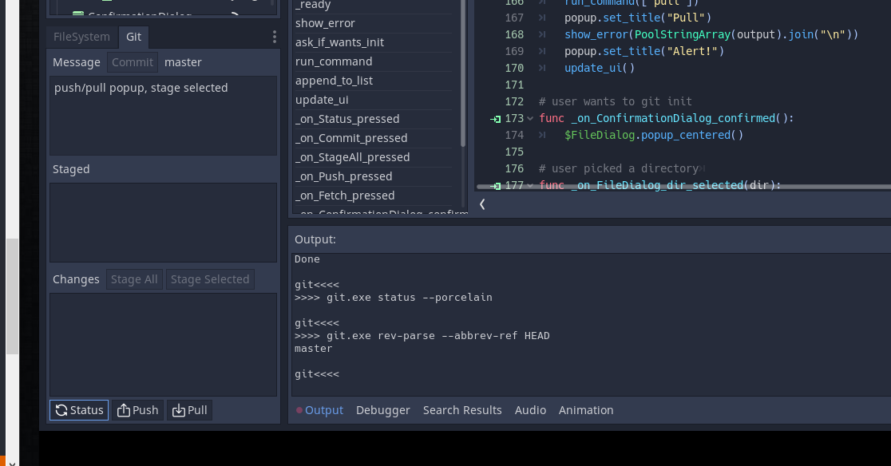

# GitAddon2

This is a git addon for Godot 3.x. It uses the system git command rather
then a library so there are the following tradeoffs/bonuses:

- credentials are handled by the system git
- lightweight, just gdscript
- functionality is limited to basic day to day git commands: add/stage/commit/push/pull. If I need more then that I use a terminal. There are also plenty of excellent git clients/guis out there. This is just intended to keep the normal Godot workflow inside Godot.
- you *must* have `git` available on the path for this thing to work

## Screens

## Install

- download the zip or clone the repo
- copy the `addons/gitaddon2` directory to your project `addons`
- you *must* have `git` available on the path for this thing to work

## License

MIT

